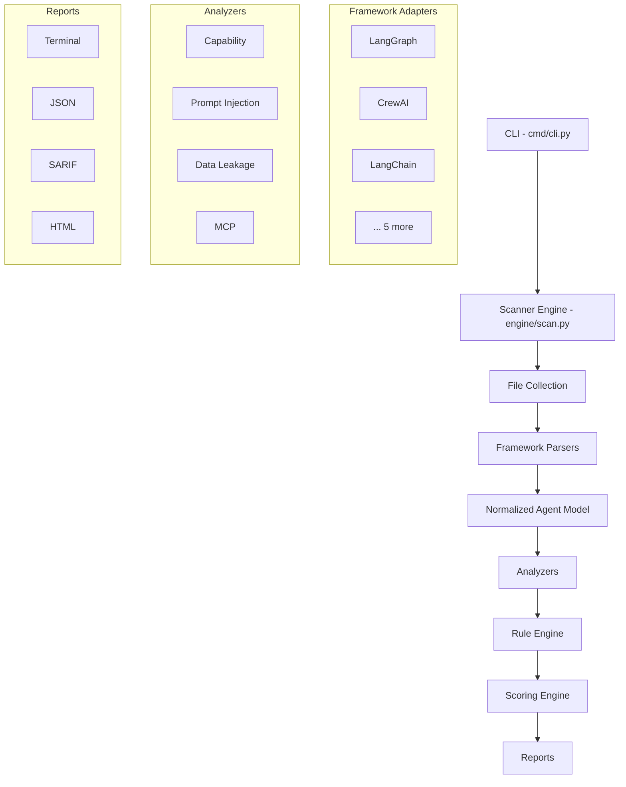
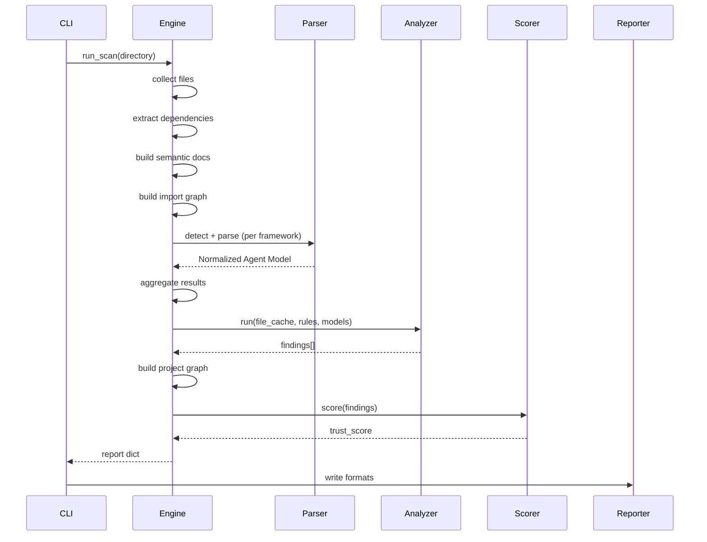

# Architecture for Contributors

This document explains SafeAI's architecture from a contributor's perspective. By the end, you'll understand how the pieces fit together and where your contribution fits in.

---

## High-Level Flow



---

## Layer-by-Layer Breakdown

### 1. CLI Layer (`cmd/cli.py`)

The entry point. Parses command-line arguments, invokes the scan, and routes output to selected report generators.

**What it does:**
- Parses `--sarif`, `--json`, `--html`, `--fail-on` flags
- Calls `run_scan(directory, rules_dir)`
- Calls each requested report writer
- Exits with code 0 or 1 based on `--fail-on` threshold

**Where to contribute:** Rarely needs changes.

---

### 2. Scanner Engine (`engine/scan.py`)

The orchestrator. Runs the entire pipeline in order.

**Pipeline steps:**
1. Collect all `.py`, `.json`, `.yaml`, `.yml` files
2. Extract dependencies from `requirements.txt`, `pyproject.toml`, etc.
3. Build semantic documents (AST parse every Python file)
4. Build import graph (module → file mappings, symbol index)
5. Run all framework parsers on every file
6. Merge parser results (aggregation + deduplication)
7. Run all analyzers
8. Build project graph
9. Compute trust score
10. Assemble report dict

**Where to contribute:** Register new parsers and analyzers here.

---

### 3. Analysis Layer (`analysis/`)

Provides foundational building blocks used by parsers and analyzers.

| Module | Purpose |
|--------|---------|
| `semantic.py` | AST parsing: extracts imports, functions, classes, calls |
| `import_graph.py` | Module → file resolution, symbol lookup, re-export tracking |
| `aggregation.py` | Merges multiple parser outputs for same file |
| `capabilities.py` | Canonical capability categories and builders |
| `project_graph.py` | Cross-file entity summary |

**Where to contribute:** Add new capability categories in `capabilities.py`.

---

### 4. Framework Parsers (`frameworks/`)

Each parser detects one AI framework and extracts its entities into the **Normalized Agent Model**.

**Parser interface:**
```python
class FrameworkParser:
    name = "framework_name"

    def detect(self, path, content, scan_ctx=None) -> bool
    def parse(self, path, content, scan_ctx=None) -> dict
```

**`detect()` checks:**
- Python imports (AST)
- Dependency manifests (`requirements.txt`, etc.)
- Configuration files (YAML, JSON)
- Content patterns (regex fallback)

**`parse()` returns a Normalized Agent Model containing:**
- `agents` — agent definitions
- `workflows` — workflow/chain definitions
- `tools` — tool definitions
- `prompts` — prompt template references
- `memory` — memory/checkpointer references
- `models` — LLM model references
- `capabilities` — inferred capability objects
- `relationships` — entity relationship edges

**Where to contribute:** Add new framework parsers, improve existing ones.

---

### 5. Normalized Agent Model

The shared data structure that all parsers produce and all analyzers consume.

```python
{
    "framework": "langgraph",
    "agents": [{"name": "...", "kwargs": {...}}],
    "workflows": [{"name": "...", "edges": [...]}],
    "tools": [{"name": "...", "kwargs": {...}}],
    "prompts": [{"name": "..."}],
    "memory": [{"name": "..."}],
    "models": [{"name": "..."}],
    "capabilities": [{"name": "shell", "category": "Shell", ...}],
    "relationships": [{"from": "...", "to": "...", "type": "uses"}],
    "parser_confidence": 0.85,
    "discovery_method": "ast+regex_fallback",
    "detection_evidence": ["imports:langgraph"]
}
```

**Why normalized?** So analyzers don't need to understand every framework — they just analyze the normalized model.

---

### 6. Analyzers (`analyzers/`)

Each analyzer implements a security or governance check.

**Analyzer interface:**
```python
class Analyzer:
    name = "analyzer_name"

    def run(self, file_cache, rules, agent_models=None) -> list[dict]
```

| Analyzer | Purpose | Rules |
|----------|---------|-------|
| Capability | Detect dangerous capabilities | `CAP_shell`, `CAP_filesystem`, etc. |
| Prompt Injection | Detect LLM01 risks | `PROMPT_INJECTION`, `PROMPT_DELIMITER`, etc. |
| Data Leakage | Detect hardcoded secrets | `DATA_LEAKAGE` |
| MCP | Validate MCP configs | `MCP_AUTH_MISSING`, `MCP_HARDCODED_SECRET`, etc. |

**Where to contribute:** Add new analyzers for new risk categories.

---

### 7. Rule Engine (`rules/`)

Rules are defined in YAML and loaded at scan time.

```yaml
- id: CAP_shell
  description: Shell execution capability detected
  severity: high
  owasp_llm: LLM06
```

Custom rule directories can override built-in rules.

**Where to contribute:** Add rules for new analyzers, improve rule descriptions.

---

### 8. Scoring Engine (`scoring/engine.py`)

Computes a deterministic 0–100 trust score per category:

```
category_score = clamp(100 - sum(weighted_contributions), 0, 100)
overall_score = average(category_scores)
```

**Where to contribute:** Fine-tune severity points and category weights.

---

### 9. Reports (`report/`)

Output generators that consume the final report dict.

| Format | File | Use Case |
|--------|------|----------|
| Terminal | `terminal.py` | CI/CD pipelines, quick feedback |
| JSON | `json_report.py` | Machine parsing, integrations |
| SARIF 2.1.0 | `sarif.py` | GitHub Advanced Security |
| HTML | `html.py` | Team review, compliance |

**Where to contribute:** Improve existing reports, add new formats.

---

## Data Flow Diagram



---

## Where Should I Contribute?

| You want to... | Start here |
|----------------|------------|
| Add a simple detection rule | `rules/base_rules.yaml` + an analyzer |
| Detect a new capability | `analyzers/capability/analyzer.py` |
| Support a new framework | `frameworks/<name>/parser.py` |
| Build a new risk analyzer | `analyzers/<name>/analyzer.py` |
| Improve output quality | `report/<format>.py` |
| Fix a bug in parsing | `analysis/semantic.py` or `analysis/import_graph.py` |

---

## Key Design Principles

1. **Pluggable** — parsers, analyzers, and reports are independent modules
2. **Deterministic** — same input produces same output every time
3. **Offline** — no network calls, no LLM invocations
4. **Confidence-aware** — every detection has a confidence score
5. **Provenance-tracked** — every finding knows which parser and analyzer produced it
